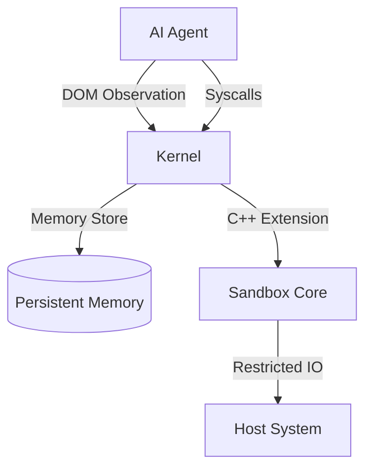

# FyodorOS
[](https://github.com/Kiy-K/FyodorOS/releases)
[](https://www.python.org/downloads/)
[](https://opensource.org/licenses/MIT)

```
███████╗██╗   ██╗ ██████╗ ██████╗  ██████╗ ██████╗
██╔════╝╚██╗ ██╔╝██╔═══██╗██╔══██╗██╔═══██╗██╔══██╗
█████╗   ╚████╔╝ ██║   ██║██║  ██║██║   ██║██████╔╝
██╔══╝    ╚██╔╝  ██║   ██║██║  ██║██║   ██║██╔══██╗
██║        ██║   ╚██████╔╝██████╔╝╚██████╔╝██║  ██║
╚═╝        ╚═╝    ╚═════╝ ╚═════╝  ╚═════╝ ╚═╝  ╚═╝
          The Experimental AI Microkernel
```

**FyodorOS** is a local-first AI Operating System that runs on your metal. Unlike traditional OSs designed for humans (GUI/CLI) or servers (API), FyodorOS exposes the entire system state as a **Document Object Model (DOM)**, allowing Agents to "perceive" and interact with the kernel natively.

## 🚀 Vision

We believe that for AI Agents to be truly useful and safe, they need an environment built for them. FyodorOS provides:
*   **Structured Observation**: The OS state (Filesystem, Processes, Users) is a queryable DOM tree.
*   **Cognitive Loop**: Built-in ReAct (Reasoning + Acting) loop at the kernel level.
*   **Safety Sandbox**: A strict, rule-based verification layer that constraints Agent actions before execution.
*   **Agent-Native Apps**: Standard tools (`browser`, `explorer`, `calc`) that return structured JSON/DOM instead of plain text, minimizing token usage and parsing errors.
*   **Cloud Integration (v0.5.0)**: Native Docker and Kubernetes support.
*   **Long-Term Memory (v0.7.0)**: Persistent semantic storage allowing agents to learn and recall information across sessions.

## 📦 Installation

### Option A: User (Recommended)
Download the installer for Windows, Mac, or Linux from the [Releases](https://github.com/Kiy-K/FyodorOS/releases) page.

### Option B: Developer (Legacy/Headless)
You can install FyodorOS as a Python package for headless or CLI-only usage.

```bash
pip install fyodoros
playwright install chromium
```

## 🛠️ Usage

FyodorOS is designed to be run as an autonomous kernel.

### CLI
```bash
# Start the kernel shell
fyodor start

# Launch an agent task
fyodor agent "Research the history of Unix and save a summary"
```

### Python API
Agents can access system capabilities via `SyscallHandler`. New in v0.7.0 is the **Persistent Memory System**:

```python
# Store a memory
sys_memory_store(
    content="The user prefers concise summaries.",
    metadata={"category": "user_preference", "source": "chat"}
)

# Recall memories
results = sys_memory_search(query="formatting preferences")
# Returns: [{'content': 'The user prefers concise summaries.', ...}]
```

## 🏗️ Architecture

FyodorOS uses a microkernel architecture with a C++ Sandbox Core for security and performance.



## 🤝 Contributing

FyodorOS is an experimental sandbox. We welcome contributions to:
- Expand the standard library of Agent Apps.
- Improve the DOM representation of system state.
- Implement more complex Sandbox rules.

---
*Built for the future of Autonomous Computing.*

[](https://star-history.com/#Kiy-K/FyodorOS&Date)
